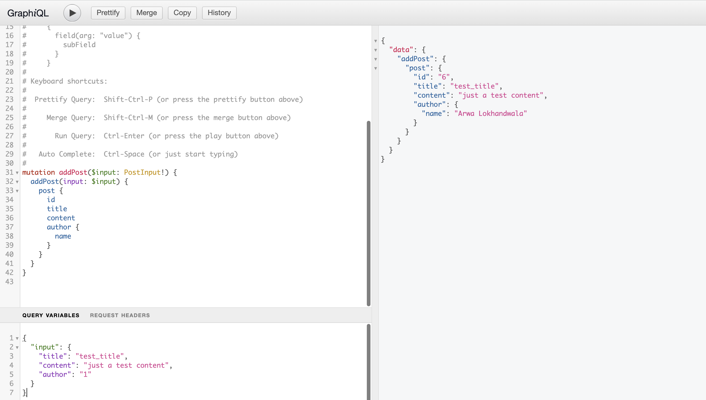
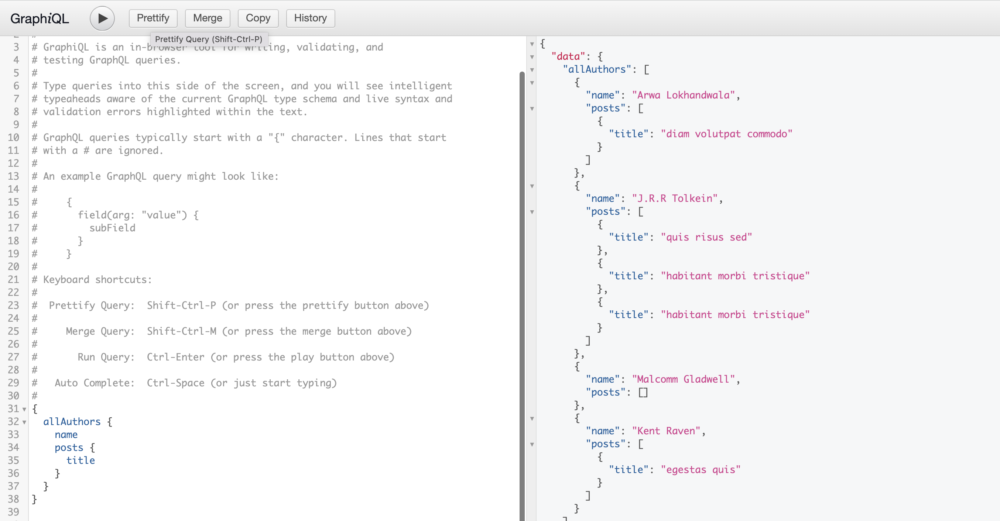

# GraphQL with Django

This project is build to try out GraphQL with Django using Docker and poetry.

## Run projects

### Create an `.env` file from `.env.example`:

```sh
cp .env.example .env
```

Note: You have to apply your actual local UID and GID in the `.env` file. Check them by running the command `id`. You can change other credentials in this file as needed.

### Start containers with the following command:

```sh
docker-compose up -d --build
```

## Usage

Open http://127.0.0.1:8000/graphql/ to see GraphiQL view.

### Populate initial data

```sh
docker exec gql-with-django_web_1 python manage.py loaddata blog
```

### Example queries:

1. Example mutation:

```
# mutation
mutation addPost($input: PostInput!) {
  addPost(input: $input) {
    post {
      id
      title
      content
      author {
        name
      }
    }
  }
}

# query variables
{
  "input": {
    "title": "test_title",
    "content": "just a test content",
    "author": "1"
  }
}
```



2. Example query

```
# query
{
  allAuthors {
    name
    posts {
      title
    }
  }
}

```



## Cleanup the entire setup

```sh
docker-compose down --volumes --remove-orphans
```
